<!-- Profile card is generated by generate_profile.py and refreshed daily by
     .github/workflows/profile.yml. Edit content there, not here. -->
<picture>
  <source media="(prefers-color-scheme: dark)" srcset="dark_mode.svg">
  <source media="(prefers-color-scheme: light)" srcset="light_mode.svg">
  
</picture>

### Career &amp; Education

<!-- career_*.svg are generated by tools/build_timeline.py -->
<picture>
  <source media="(prefers-color-scheme: dark)" srcset="career_dark.svg">
  <source media="(prefers-color-scheme: light)" srcset="career_light.svg">
  
</picture>

### Publications

- [A Novel Gesture Based Graphical Authentication Using Bounding Box and Corner Detection Algorithm](https://doi.org/10.1109/ICCSP.2012.6208405) — _2012 Int'l Conference on Communication and Signal Processing (ICCSP), IEEE_
- [Analysis of Cooperation of Node Movement and its Effects on Messaging Delay in DTN Systems](https://cir.nii.ac.jp/crid/1520290884246514304) — _IEICE Technical Report, NS2012-138 (with H. Wakayama, M. Ogawa; NEC, Japan)_
- [Graphical Authentication Using Region Based Graphical Password](https://doi.org/10.47893/ijcsi.2013.1125) — _Int'l Journal of Computer Science & Informatics_
- Investigation of Educational Content Delivery in Villages Using Bus Assisted DTN and its Simulation Analysis — _CiiT Int'l Journal of Networking & Communication Engineering, Vol. 7(2), 2015_
- Performance Comparisons of Single &amp; Multipath Routing Protocol over MANETs — _Int'l Journal of Computer Science & Information Technology, Vol. 3(1), 2010_
- A Cryptosystem Based on Elliptic Curve Cryptography — _Int'l Journal of Computer Science & Information Technology, Vol. 3(1), 2010_
- Liquid Interface Control Using Hand Gesture — _Int'l Journal of Computer Science & Information Technology, Vol. 3(1), 2010_

### Connect

### Tech &amp; Tools

<!-- tools_*.svg are generated by tools/build_tools.py -->
<picture>
  <source media="(prefers-color-scheme: dark)" srcset="tools_dark.svg">
  <source media="(prefers-color-scheme: light)" srcset="tools_light.svg">
  
</picture>
